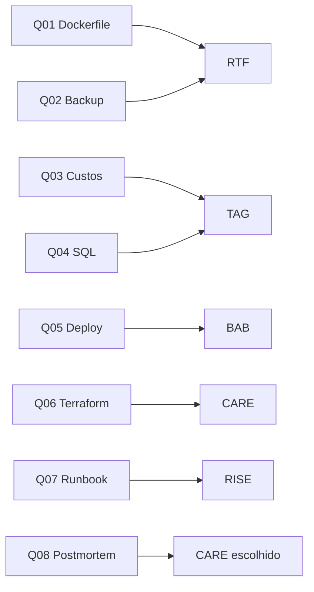

# HowTo — Plano de execução do desafio

Guia de **planejamento** (fase 1). Os prompts finais, outputs e justificativas serão preenchidos na **fase 2**, executando cada plano no **Composer 2.5** (Cursor).

---

## Convenções gerais

| Item | Decisão |
|------|---------|
| Modelo | Composer 2.5 (Cursor) em todas as questões |
| Prompts e docs | PT-BR |
| Código (Dockerfile, bash, SQL, YAML, Terraform) | en_US |
| Data de referência (Q04) | `2026-04-24` |
| Entrega por questão | `prompt.md` · `modelo.md` · `output.md` · `justificativa.md` |

### Fluxo por questão (fase 2)

1. Montar o prompt seguindo o framework e o checklist deste HowTo.
2. Executar no Composer 2.5 e colar a resposta em `output.md`.
3. Se o output for um arquivo executável, salvá-lo na pasta da questão (ex.: `Dockerfile`, `backup-ledger.sh`).
4. Registrar em `modelo.md` e `justificativa.md`.
5. Revisar: output atende ao enunciado? Componentes do framework visíveis no prompt?

---

## Questão 01 — Dockerfile para o Lift

| Campo | Valor |
|-------|--------|
| **Pasta** | `q01-dockerfile/` |
| **Framework** | **RTF** (Role · Task · Format) |
| **Artefato** | `Dockerfile` (+ opcional `.dockerignore`) |

### Objetivo

Produzir Dockerfile de produção para API Python/Flask na porta 8080, com `requirements.txt`, variáveis `DATABASE_URL` e `API_KEY`, comando `gunicorn --bind 0.0.0.0:8080 --workers 4 app:app`, boas práticas (multi-stage se fizer sentido, usuário não-root, `.dockerignore`, healthcheck).

### Plano do prompt (RTF)

| Componente | O que incluir no prompt |
|------------|-------------------------|
| **Role** | Especialista em containers Python/Kubernetes (ex.: engenheiro DevOps sênior). |
| **Task** | Gerar Dockerfile para o projeto `lift/` com estrutura e `requirements.txt` do enunciado; listar boas práticas obrigatórias (non-root, camadas, env vars, porta 8080, gunicorn). |
| **Format** | Apenas o `Dockerfile` em bloco de código; comentários em en_US; sem explicação longa fora do arquivo (ou seção breve “assumptions” no final, se necessário). |

### Checklist antes de executar

- [ ] Colar estrutura de pastas e conteúdo de `requirements.txt` do enunciado.
- [ ] Mencionar as duas env vars sem valores reais (secrets em runtime).
- [ ] Pedir imagem base slim e usuário não-root.
- [ ] Pedir `EXPOSE 8080` e comando gunicorn exato do enunciado.

### Artefatos esperados na pasta

- `prompt.md`, `modelo.md`, `output.md`, `justificativa.md`
- `Dockerfile` (gerado na fase 2)

---

## Questão 02 — Script de backup do Ledger

| Campo | Valor |
|-------|--------|
| **Pasta** | `q02-backup/` |
| **Framework** | **RTF** |
| **Artefato** | `backup-ledger.sh` (cron-ready) |

### Objetivo

Script bash: `pg_dump` → `gzip` → `aws s3 cp` → retenção 30 dias no S3 → log em `/var/log/ledger-backup.log` → exit codes corretos.

### Plano do prompt (RTF)

| Componente | O que incluir no prompt |
|------------|-------------------------|
| **Role** | Engenheiro SRE especialista em PostgreSQL e AWS (backup/restore). |
| **Task** | Escrever script bash completo com host, porta, banco, usuário, `PGPASSWORD` via env, bucket `hvt-ledger-backups`, região `us-east-1`, diretório `/var/backups/ledger`, retenção S3 30 dias, logging com timestamp, tratamento de erro. |
| **Format** | Script único em bloco `bash`; comentários en_US; ao final, 3 linhas em PT-BR com exemplo de entrada cron. |

### Checklist antes de executar

- [ ] Todos os parâmetros do enunciado (host, paths, bucket, retenção).
- [ ] `set -euo pipefail` ou equivalente.
- [ ] Remoção de objetos S3 mais antigos que 30 dias (comando explícito).
- [ ] Exit code ≠ 0 em falha de dump, upload ou compressão.

### Artefatos esperados na pasta

- `prompt.md`, `modelo.md`, `output.md`, `justificativa.md`
- `backup-ledger.sh` (fase 2)

---

## Questão 03 — Relatório de redução de custos cloud

| Campo | Valor |
|-------|--------|
| **Pasta** | `q03-custos-cloud/` |
| **Framework** | **TAG** (Task · Action · Goal) |
| **Artefato** | Relatório em markdown (no `output.md` ou `relatorio-custos.md`) |

### Objetivo

A partir do CSV de custos AWS, produzir relatório para Goldie: oportunidades priorizadas por impacto, % da conta total, esforço (baixo/médio/alto), riscos/pré-requisitos, alinhado à meta de **15%** de redução sem degradar SLA.

### Plano do prompt (TAG)

| Componente | O que incluir no prompt |
|------------|-------------------------|
| **Task** | Analisar o CSV fornecido e identificar oportunidades de economia cloud. |
| **Action** | Priorizar por impacto em USD e %; classificar esforço; listar riscos; estimar economia acumulada rumo a 15%. |
| **Goal** | Relatório executivo para diretoria (Goldie) com recomendações acionáveis no trimestre, sem comprometer SLA. |

### Checklist antes de executar

- [ ] CSV completo colado no prompt.
- [ ] Tabela de saída: oportunidade | economia estimada | % conta | esforço | riscos.
- [ ] Linha de síntese: total estimado vs. meta 15%.
- [ ] Formato markdown, PT-BR.

### Artefatos esperados na pasta

- `prompt.md`, `modelo.md`, `output.md`, `justificativa.md`
- Opcional: `relatorio-custos.md` (cópia formatada do output)

---

## Questão 04 — Relatório mensal de transações (SQL)

| Campo | Valor |
|-------|--------|
| **Pasta** | `q04-sql-transacoes/` |
| **Framework** | **TAG** |
| **Artefato** | `query.sql` |

### Objetivo

Query PostgreSQL: últimos 6 meses a partir de **2026-04-24**, `status = 'completed'`, agrupamento `YYYY-MM` + `category`, métricas quantidade e volume em BRL (2 decimais), ordenação mês ↑ categoria ↑.

### Plano do prompt (TAG)

| Componente | O que incluir no prompt |
|------------|-------------------------|
| **Task** | Escrever query SQL para relatório de transações do Ledger conforme schema e regras do enunciado. |
| **Action** | Usar `DATE_TRUNC` ou equivalente; filtrar 6 meses; converter `amount_cents` para reais; agrupar e ordenar. |
| **Goal** | SQL pronto para Jennifer executar no PostgreSQL e obter tabela para apresentação à Goldie. |

### Checklist antes de executar

- [ ] DDL das tabelas `transactions` e `customers` no prompt.
- [ ] Data âncora: `2026-04-24`.
- [ ] Categorias e filtro `completed` explícitos.
- [ ] Output: apenas SQL em bloco, comentários en_US opcionais.

### Artefatos esperados na pasta

- `prompt.md`, `modelo.md`, `output.md`, `justificativa.md`
- `query.sql` (fase 2)

---

## Questão 05 — Modernizar deployment legado

| Campo | Valor |
|-------|--------|
| **Pasta** | `q05-deployment-chronos/` |
| **Framework** | **BAB** (Before · After · Bridge) |
| **Artefato** | `deployment-chronos-modern.yaml` |

### Objetivo

Transformar manifest legado (1 réplica, `latest`, secrets em plain text, sem probes/resources/securityContext) em deployment de produção aderente ao padrão HVT.

### Plano do prompt (BAB)

| Componente | O que incluir no prompt |
|------------|-------------------------|
| **Before** | Colar o YAML legado completo do enunciado (estado atual). |
| **After** | Descrever estado desejado: HA (≥2 réplicas), tag de imagem versionada, Secrets/ExternalSecrets, requests/limits, liveness/readiness, `securityContext` non-root, `runAsNonRoot`, sem secrets em env plain. |
| **Bridge** | Instruir: “Modernize o manifest mantendo nome/namespace/labels; use placeholders para secrets; adicione comentários en_US onde houver decisão de segurança.” |

### Checklist antes de executar

- [ ] YAML Before íntegro no prompt.
- [ ] Lista explícita de gaps do Before vs. padrão empresa.
- [ ] After como bullet list verificável.
- [ ] Saída: um único manifest Kubernetes válido.

### Artefatos esperados na pasta

- `prompt.md`, `modelo.md`, `output.md`, `justificativa.md`
- `deployment-chronos-modern.yaml` (fase 2)

---

## Questão 06 — Módulo Terraform S3

| Campo | Valor |
|-------|--------|
| **Pasta** | `q06-terraform-s3/` |
| **Framework** | **CARE** (Context · Action · Result · Example) |
| **Artefato** | Módulo Terraform + `examples/basic/` |

### Objetivo

Módulo reutilizável S3 aderente ao padrão Strickland: tags, prefixo `hvt-`, encryption, versioning, block public access, logging; `variables.tf` com description/type; exemplo de uso no estilo do módulo VPC de referência.

### Plano do prompt (CARE)

| Componente | O que incluir no prompt |
|------------|-------------------------|
| **Context** | Padrão interno HVT (bullets do enunciado) + trecho do módulo VPC de referência. |
| **Action** | Criar módulo `modules/s3-bucket` com `main.tf`, `variables.tf`, `outputs.tf`, `versions.tf`. |
| **Result** | Bucket aderente, consumível por outros times; outputs: arn, id, domain. |
| **Example** | Pedir `examples/basic/main.tf` chamando o módulo com variáveis de exemplo. |

### Checklist antes de executar

- [ ] Todos os requisitos de compliance listados.
- [ ] Estilo de `locals.common_tags` e naming como o VPC.
- [ ] Nenhum valor secreto hardcoded.
- [ ] Comentários Terraform em en_US.

### Artefatos esperados na pasta

- `prompt.md`, `modelo.md`, `output.md`, `justificativa.md`
- `modules/s3-bucket/*.tf` e `examples/basic/main.tf` (fase 2)

---

## Questão 07 — Runbook alerta de memória

| Campo | Valor |
|-------|--------|
| **Pasta** | `q07-runbook-memoria/` |
| **Framework** | **RISE** (Role · Input · Steps · Expectation) |
| **Artefato** | `runbook-memoria-chronos.md` |

### Objetivo

Runbook procedural para `[CRITICAL] High memory usage on Chronos API pods (>85% for 10min)`: diagnóstico com comandos, verificação por passo, critérios de escalação e encerramento.

### Plano do prompt (RISE)

| Componente | O que incluir no prompt |
|------------|-------------------------|
| **Role** | Autor de runbooks SRE para plantão Kubernetes (público: plantonista sem deep knowledge do Chronos). |
| **Input** | Ambiente do enunciado (EKS, HPA, Argo CD, deps Ledger/Reactor, ferramentas, Slack, SLA @chronos-core). |
| **Steps** | Seções numeradas: triagem → kubectl metrics → logs → HPA → deps → escalação; cada passo com comando, resultado esperado, “se falhar, então…”. |
| **Expectation** | Tempo alvo (<40 min); critérios objetivos para escalar; critério de “incidente resolvido”; link para canal Slack. |

### Checklist antes de executar

- [ ] Comandos `kubectl` e `aws`/`argocd` concretos (namespace `production`).
- [ ] Tabela ou checklist de escalação (@chronos-core, 15/30 min).
- [ ] Critério de encerramento mensurável (memória < X% por Y min).
- [ ] Markdown PT-BR; comandos e paths em en_US.

### Artefatos esperados na pasta

- `prompt.md`, `modelo.md`, `output.md`, `justificativa.md`
- `runbook-memoria-chronos.md` (fase 2)

---

## Questão 08 — Postmortem técnico (framework escolhido)

| Campo | Valor |
|-------|--------|
| **Pasta** | `q08-postmortem/` |
| **Framework escolhido** | **CARE** |
| **Alternativas a comparar na justificativa** | **BAB** e **RISE** |
| **Artefato** | `postmortem-chronos.md` |

### Objetivo

Postmortem em ~20 min para Doc Brown decidir: **rollback v2.48.0** vs. **scaling emergencial** (RDS limits + pool de conexões), com base em deploy changelog, métricas, logs, fila Reactor e estado do cluster.

### Por que CARE (plano)

| Critério | CARE |
|----------|------|
| Contexto denso | Enunciado traz múltiplos artefatos (deploy, métricas, logs, fila, cluster) — CARE prioriza Context + Example. |
| Resultado claro | Postmortem estruturado: linha do tempo, hipóteses, causa provável, recomendação rollback vs. scale. |
| Example | Pedir template de postmortem (seções fixas) como o “módulo VPC” da Q06. |

### Plano do prompt (CARE)

| Componente | O que incluir no prompt |
|------------|-------------------------|
| **Context** | Todos os artefatos do enunciado + decisão pendente (rollback vs. scaling) + janela de 20 min. |
| **Action** | Analisar correlação deploy v2.48.0 ↔ latência/erros ↔ pool Ledger ↔ lag Reactor; ranquear hipóteses. |
| **Result** | Documento com recomendação fundamentada e próximos passos imediatos (3 bullets acionáveis). |
| **Example** | Esqueleto: Resumo · Impacto · Linha do tempo · Causa raiz · Fatores contribuintes · Decisão · Ações imediatas · Follow-ups. |

### O que registrar em `justificativa.md` (comparação)

| Framework | O que se ganharia | O que se perderia |
|-----------|-------------------|-------------------|
| **CARE** ✓ | Contexto rico + formato de postmortem via Example | Menos ênfase em “estado antes/depois” narrativo |
| **BAB** | Contraste claro pré/pós incidente e “ponte” de remediação | Menos estrutura para múltiplos logs/métricas simultâneas |
| **RISE** | Passos de plantão e escalação operacional | Fraco para análise correlacional e decisão estratégica rápida |

### Checklist antes de executar

- [ ] Colar changelog v2.48.0, tabela de métricas, logs e estado Reactor/cluster.
- [ ] Pedir recomendação explícita: rollback **ou** scaling (com prós/contras de cada um).
- [ ] Mencionar evidências: pool exhausted, timeout 2s, circuit breaker, lag 18 min.
- [ ] Justificativa estendida (≥2 frameworks alternativos).

### Artefatos esperados na pasta

- `prompt.md`, `modelo.md`, `output.md`, `justificativa.md` (estendida)
- `postmortem-chronos.md` (fase 2)

---

## Mapa frameworks × questões

---

## Próximo passo (fase 2)

Executar na ordem **Q01 → Q08** (ou paralelizar Q01/Q02 por serem RTF independentes). Após cada execução no Composer 2.5, atualizar os quatro arquivos da pasta e o status na tabela do `README.md`.
